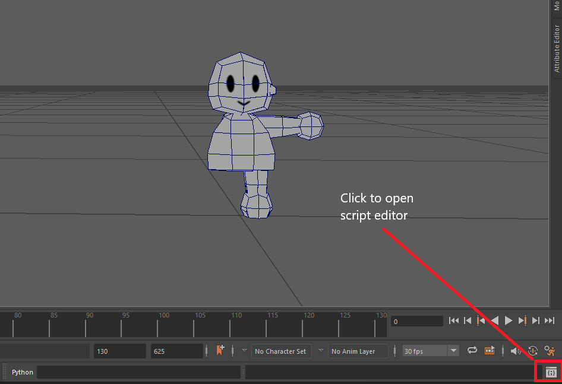
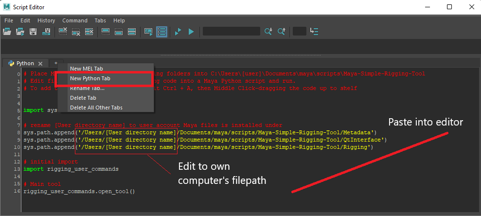
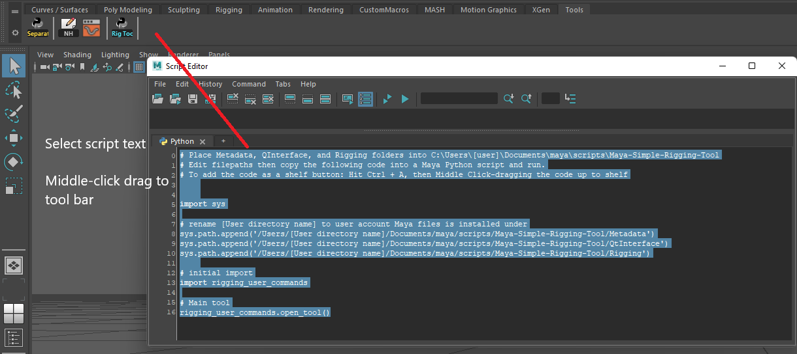

# Overview
This tool is a simple rigging helper tool for Maya. It automates common rigging and control setup tasks.

Metadata modules provided courtesy of Micah Zahm

**Skeleton Joint Setup**
  - Save & Load Rig Templates from a JSON file
  - Mirror rig across XY/YZ/ZX planes

**Rig Control Setup**
  - Create and auto-rename controls on top of joints
  - Constrain controls on joints
  - Mirror control hierarchy across XY/YZ/ZX planes

**Weight Painting Tasks**
  - Flood mesh with weight paint from a joint
  - Flood vertex with weight paint value from a joint

# Setup

1. Open Maya script editor

2. Edit filepath, then paste following code block into a **Python** script editor

    
    # Place Metadata, QInterface, and Rigging folders into C:\Users\[user]\Documents\maya\scripts\Maya-Simple-Rigging-Tool
    # Edit filepaths then copy the following code into a Maya Python script and run.
    
    # To add the code as a shelf button: 
    # Select all script text, then Middle-click drag the code up to shelf

    import sys

    # rename [User directory name] to user account Maya files is installed under
    sys.path.append('/Users/[User directory name]/Documents/maya/scripts/Maya-Simple-Rigging-Tool/Metadata')
    sys.path.append('/Users/[User directory name]/Documents/maya/scripts/Maya-Simple-Rigging-Tool/QtInterface')
    sys.path.append('/Users/[User directory name]/Documents/maya/scripts/Maya-Simple-Rigging-Tool/Rigging')
    
    # initial import
    import rigging_user_commands
    
    # Main tool
    rigging_user_commands.open_tool()

    

3. Create a Toolbar Button for ease of use by middle-click dragging script text

